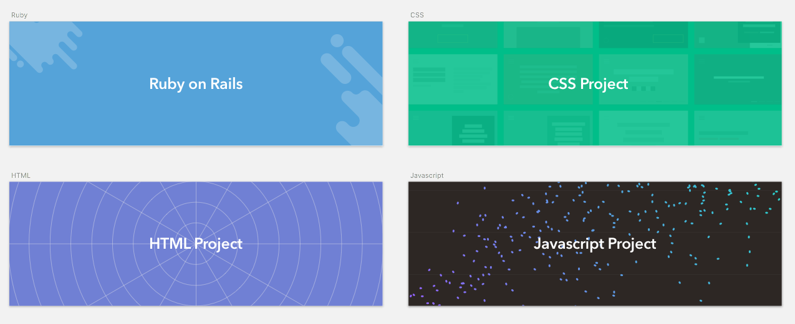

# Mark

Open Source Project Readme template



## Getting Started

These instructions will get you a copy of your project's README file. You can modify this file and use it for your own open source and private projects. The [sketch](Mark_sketch.sketch) file included can be used for assigning a cover image for your project.

List of things that you'll need to change while using this in your project -

- Project Name
- Description
- Tags
- Cover Image
- Getting Started Instructions
- Filling in correct Prerequisites
- Installation Steps
- Explain "How to run" tests
- Deployment Details
- "Built with" Details
- Contribution, Versioning and Authors Information
- Correct License Information
- Acknowledgement Info (if any)

### Prerequisites

The things that you'll need to install the software and how to install them

```
Give examples
```

### Installing

A step-by-step series of examples that tell you how to get a development env running

Say what the step will be

```
Give the example
```

And repeat

```
until finished
```

End with an example of getting some data out of the system or using it for a little demo

## Running the tests

Explain how to run the automated tests for this system

### Break down into end to end tests

Explain what these tests test and why

```
Give an example
```

### And coding style tests

Explain what these tests test and why

```
Give an example
```

## Deployment

Add additional notes about how to deploy this on a live system

## Built With

* [Ruby on Rails](http://rubyonrails.org) - The web framework used
* [Yarn](https://yarnpkg.com) - Dependency Management
* [jQuery](https://jquery.com) - For that Sweet DOM Manipulation

## Contributing

Please read [CONTRIBUTING.md](#) for details on our code of conduct, and the process for submitting pull requests to us.

## Versioning

We use [Github](http://github.com/) for versioning. For the versions available, see the tags on this repository. 

## Authors

* **Karthik K** - *Initial work* - [Skcript](https://skcript.com/)
* **Praveen Juge** - *Updates* - [Skcript](https://skcript.com/)

See also the list of [contributors](https://github.com/skcript/Mark/graphs/contributors) who participated in this project.

## License

This project is licensed under the MIT License - see the [LICENSE.md](LICENSE.md) file for details.

	MIT License

	Copyright (c) 2017 Skcript

	Permission is hereby granted, free of charge, to any person obtaining a copy
	of this software and associated documentation files (the "Software"), to deal
	in the Software without restriction, including without limitation the rights
	to use, copy, modify, merge, publish, distribute, sublicense, and/or sell
	copies of the Software, and to permit persons to whom the Software is
	furnished to do so, subject to the following conditions:

	The above copyright notice and this permission notice shall be included in all
	copies or substantial portions of the Software.

## Acknowledgments

* Hat tip to anyone who's code was used
* Inspiration
* etc

## About


This Project is maintained by Skcript. The names and logos for
Skcript are properties of Skcript.

We love open source, and we have been doing quite a bit of contributions to the community. Take a look at them [here][skcriptoss]. Also, encourage people around us to get involved in community [operations][community]. [Join us][hiring], if you'd like to see the world change from our HQ.

[skcriptoss]: http://skcript.github.io/
[community]: http://discourse.skcript.com/
[hiring]: http://www.skcript.com/careers?utm_source=github